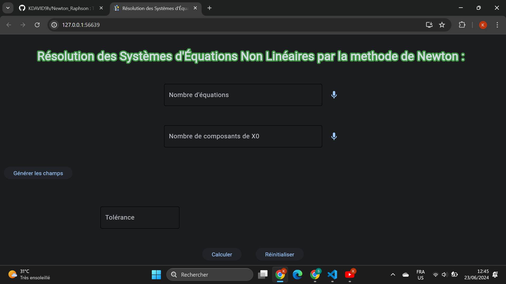

# A newton Flet app



# Usage
- Install requirements
- Run the app and follow instructions
## Run
#### To run the app:
```
flet run --web main.py
```

## Build
	flet build \ [apk, ios, web,...]

# Structure

Project/
│
├── main.py
├── ui/
│   ├── __init__.py
│   ├── layout.py
│   ├── widgets.py
│   ├── styles.py
│   └── handlers.py
├── solver/
│   ├── __init__.py
│   ├── newton_raphson.py
│   └── parser.py
├── assets/
│   ├── app_icon.png
│   └── lottie_animation.json
|
├── test/
|   ├── test.py


# Author

### HOGNON Kossi David